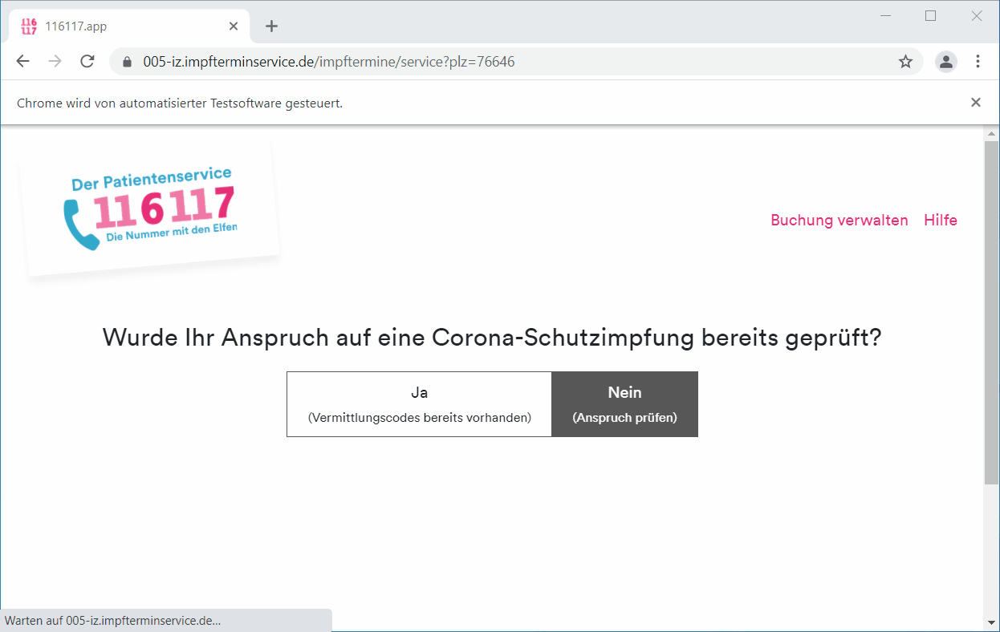

# Impfbot

Impfbot is a Python scripts which checks periodically for available vaccination appointments against the SARS-CoV-2 / COVID-19 coronavirus on [impfterminservice.de](https://impfterminservice.de) which is used in most German federal states.



## Requirements

- Python 3
- Google Chrome
- Microsoft Windows

## Setup

```sh
pip install .
```

## Usage

First add your post codes and transfer codes (if available) to the `config.ini`. If you don't have transfer codes, just enter `x` or some invalid code. Then start the Python script:

```sh
python impfbot
```
